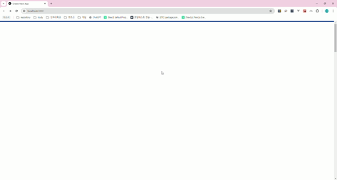

# react-scroll-header-loading
<hr/>
javascript scroll event 를 통해 현재 위치를 확인하여 상단 loading-bar 에 표시해주는 react component입니다.
<br>
<br>


## 설치방법
<hr/>

```npm
  npm install --save react-scroll-header-loading
```

## 사용방법
<hr/>

```javascript
import ReactScrollHeaderLoading from 'react-scroll-header-loading';

// 상단 loading-bar 가 필요한 경우
<ReactScrollHeaderLoading.ScrollHeaderLoadingBar/>
<div style={{'height': '1000px'}}></div>
<div style={{'height': '1000px'}}></div>
<div style={{'height': '1000px'}}></div>
<div style={{'height': '1000px'}}></div>
<div style={{'height': '1000px'}}></div>

// 현재 위치가 필요한 경우
console.log(ReactScrollHeaderLoading.CalculateScroll())
```

#### ScrollHeaderLoadingBar 옵션

| 이름 | 설명                | 기본값    |
|------|-------------------|--------|
| loadingBarTopColor | 상단 bar의 색상        | #003185 |
| loadingBarTopHeight | 상단 bar의 높이        | 5px    |
| loadingBarColor | scroll 영역 bar의 색상 | #2596be      |
| loadingBarHeight | scroll 영역 bar의 높이 | 5px       |

## 지원 브라우저
<hr/>

IE9 이상부터 지원합니다. (modern browser 지원 O)

## License
<hr/>

<a href="./LICENSE">MIT License</a>